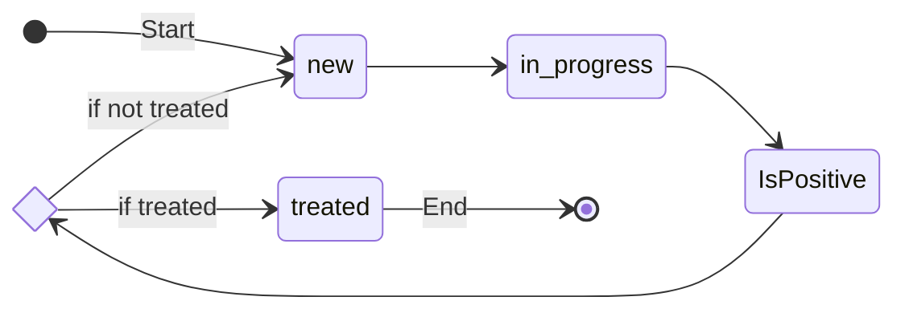

[Documentation](../README.md) > [Workflows](README.md) > Values workflow

# Values workflow

```mermaid
	stateDiagram-v2
		direction LR
		state if_state <<choice>>
			[*] --> new : Start
			new --> in_progress
			in_progress --> IsPositive
			IsPositive --> if_state
			if_state --> treated : if treated
			if_state --> new : if not treated
			treated --> [*] : End
```